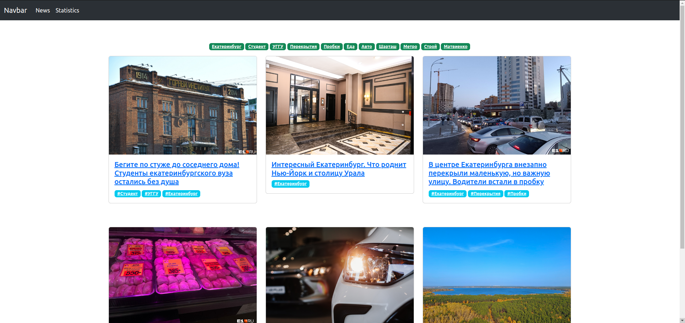
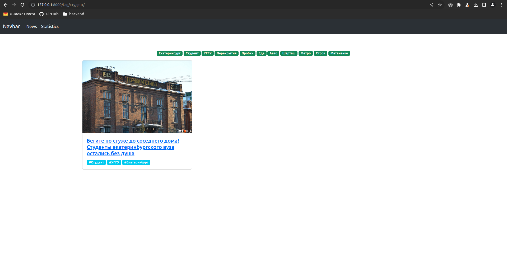
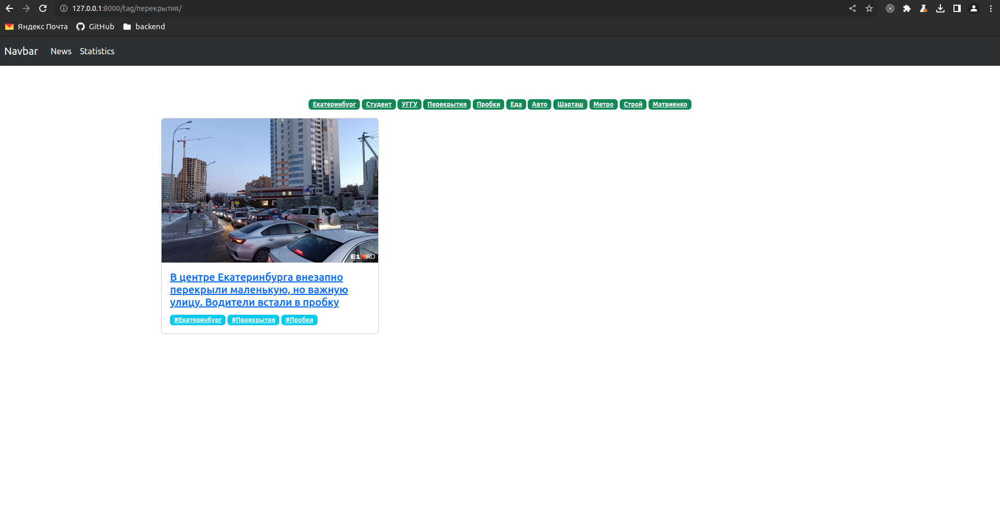
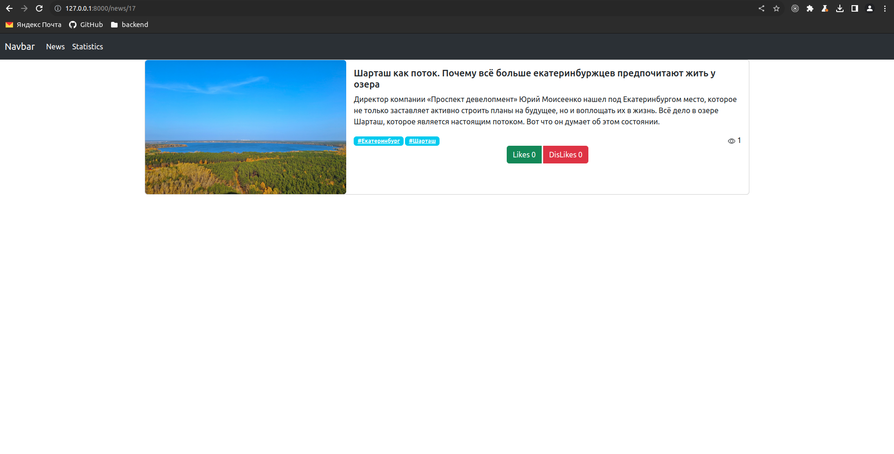
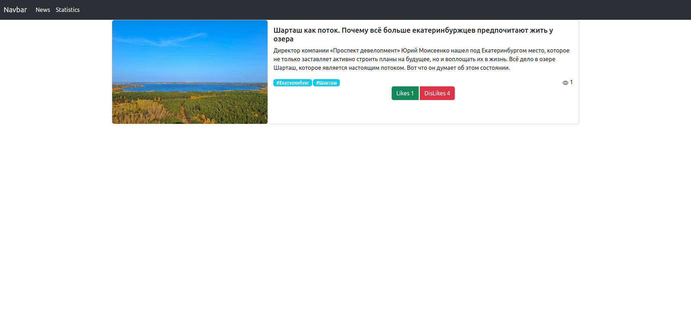
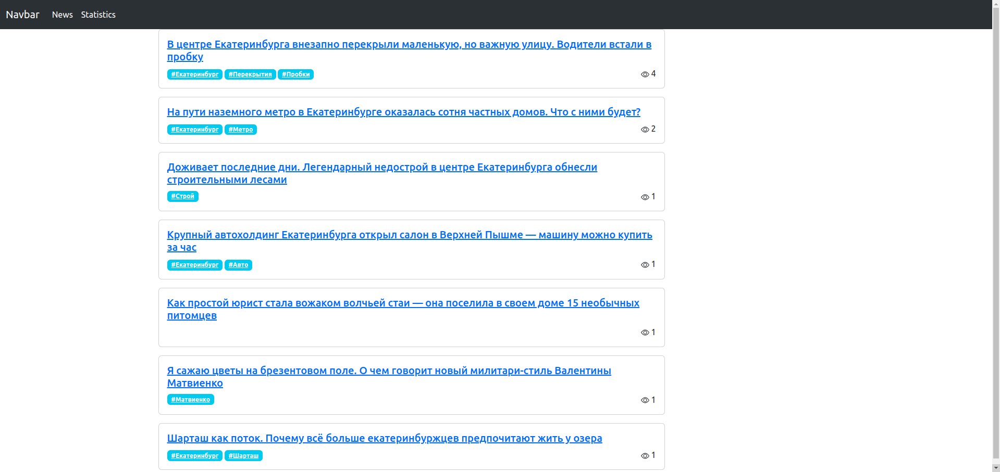

# **Тестовое задание для Django разработчика**

На Django реализовать список новостей с возможностью просматривать новость. Каждая новость должна включать теги. Нужно уметь заполнять новости в админке. Каждая новость состоит из Заголовка, Текста, Картинки, тегов. 

1. Нужно иметь страницы: Новости, Новость, Новости по тегу.


2. Также должна быть страница статистике просмотров новостей.


3. По REST-API новости возможность получить/создать/удалить новости. 


4. Бесконечный скрол на чистом JS, который вытягивает по 3 новости при скроллинге без перезагрузки страницы. Идея бесконечного скрола в том, чтобы по кусочкам показывать данные с бэкенда. Представьте что в базе 1000 новостей.


5. Также нужно сделать лайк и дизлайк новости также на js, при котором при лайке новости отображается актуальное количество лайков, даже если в момент просмотра новости произошел лайк другим пользователем сайта.


6. Дизайн не важен, можно использовать bootstrap. 

Код опубликовать на гитхаб и скинуть ссылку на mail@zavod-it.com вместе со скринами того, что получилось. В письме также укажите затраченое время на выполнение задания. Напишите также сообщение на hh, что выполнили задание. 

Срок выполнения 2-3 дня.


### Используемые Версии:
```
    Docker: version 24.0.2, build cb74dfc
    Docker-Compose: version v2.21.0
    Ubuntu 20.04.6 LTS
    Python: 3.11
```

### Используемые инструменты:
```
    Django==4.2.6
    djangorestframework==3.14.0
    channels==3.0.5
    channels-redis==3.3.0
    django-taggit==4.0.0
    psycopg2-binary==2.9.9
    six==1.16.0
```

### Инструкция по запуску:
```
    1. Зайдите в корень проекта
    2. Выполните следующую команду: sudo docker-compose up --build
    3. Создайте SuperUser:
                            sudo docker ps
                            sudo docker exec -it <container_id_news_project> python manage.py createsuperuser
    4. Админка:
            http://127.0.0.1:8000/admin
       Сайт:
            http://127.0.0.1:8000/

    Чтобы подключиться к postgres DB:
        1. Выполните в корне следующие комманды:
            docker ps
            docker inspect -f '{{range.NetworkSettings.Networks}}{{.IPAddress}}{{end}}' <container_id_postgres>
```

### API:
API для Postman: ```News.postman_collection.json```

### Фотографии:
### 
### 
### 
### 
### 
### 
### 
### 
### 